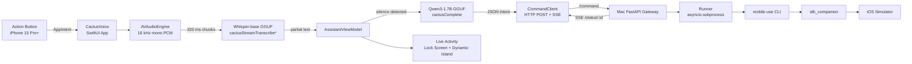

# Architecture



## Components

### iPhone (`ios/CactusVoice/`)

| Layer | File | Role |
| --- | --- | --- |
| Entry | `CactusVoiceApp.swift` | `@main`, requests mic permission, gates first-launch download |
| Intent | `Intents/StartListeningIntent.swift` | AppIntent + AppShortcuts → bound to Action Button |
| Engine | `Cactus/CactusEngine.swift` | Actor wrapping `cactusInit` / `cactusComplete` / `cactusStreamTranscribe*` |
| Models | `Models/ModelCatalog.swift`, `ModelDownloader.swift` | HF download + sha256 verify into `Application Support/models/` |
| Capture | `Services/TranscribeService.swift` | AVAudioEngine, 16 kHz Int16 PCM, RMS VAD with 800 ms hangover |
| Reasoning | `Services/IntentService.swift` | Few-shot prompt → JSON intent, post-process to strip prose |
| Network | `Networking/PairingStore.swift`, `CommandClient.swift` | Keychain pairing + `URLSession` POST + SSE consumer |
| Live Activity | `LiveActivity/ListeningAttributes.swift` (Shared), `Widget/ListeningLiveActivity.swift` | Lock Screen + Dynamic Island |
| ViewModel | `ViewModels/AssistantViewModel.swift` | Linear state machine: `idle → listening → transcribing → thinking → sending → running → succeeded/failed` |

### Mac (`mac-server/`)

| Layer | File | Role |
| --- | --- | --- |
| Entry | `cli.py` | Typer CLI; `--pair` prints QR; auto-generates `CACTUS_TOKEN` |
| API | `server.py` | FastAPI: `/health`, `/command`, `/status/:id` (SSE), `/cancel/:id` |
| Auth | `auth.py` | Constant-time bearer-token check |
| Runner | `runner.py` | Spawns `mobile-use` via `asyncio.subprocess`, fans out status to subscribers |
| Pairing | `pairing.py` | Bonjour `_cactus._tcp.local.` advertise + ASCII QR generator |

## State Machine

```
        ┌──────────┐
        │   idle   │◀────────────┐
        └────┬─────┘             │
             │ Action Button     │
             ▼                   │
        ┌──────────┐             │
        │loadingMdl│             │
        └────┬─────┘             │
             ▼                   │
        ┌──────────┐  silence    │
        │listening │────────┐    │
        └────┬─────┘        │    │
             │ stop tap     │    │
             ▼              ▼    │
        ┌──────────────────────┐ │
        │     transcribing     │ │
        └────┬─────────────────┘ │
             ▼                   │
        ┌──────────┐             │
        │ thinking │             │
        └────┬─────┘             │
             ▼                   │
        ┌──────────┐             │
        │ sending  │             │
        └────┬─────┘             │
             ▼                   │
        ┌──────────┐  done       │
        │ running  │─────────────┘
        └──────────┘
```

## Why these models

| Model | Why |
| --- | --- |
| Whisper-base INT4 (~60 MB) | Smallest viable Whisper for 16 kHz English; runs comfortably even on iPhone 14 |
| Qwen3-1.7B INT4 (~1 GB) | Fastest LLM that produces valid JSON under tight system prompt; default for normal commands |
| Gemma 3 4B INT4 (~2.5 GB) | Stronger reasoning when the spoken transcript is ambiguous; user can swap via picker. Requires iPhone 15 Pro / Air or newer (≥6 GB RAM) |

## Why Mac runs `mobile-use` (not iPhone)

[`mobile-use`](https://github.com/minitap-ai/mobile-use) drives a UI tree via `idb_companion`, which is a macOS-only binary. Phone-side execution is out of scope for v1.

## Out of scope

- Background mic capture (Action Button always foregrounds the app, which sidesteps this).
- Speaker diarization (single-speaker assumption).
- Pushed Live Activity updates (uses local `Activity.update`, not APNs).
- Tool calls / RAG inside the on-device LLM (`toolsJson` stays `nil`).
